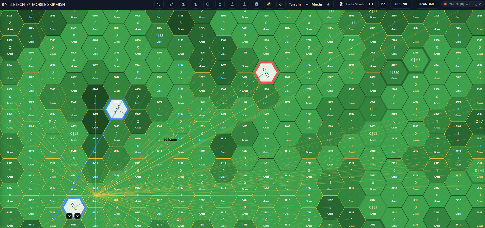

# BATTLETECH // Mobile Skirmish

Take **BattleTech** anywhere.  
This is a browser-based **hex map skirmish tool** designed for quick games on tablets, laptops, or desktops — no maps, dice, or minis required. Just open the link and play.

---

## 🔄 Cross-App Crossover  

Mobile Skirmish now links directly with **[TRS:80 // Technical Readout System:80](https://nevar530.github.io/TRS80/)**.  

- **Export from TRS:80 Lance Builder** → produces a `"Lance Name".json` file  
- **Import into Mobile Skirmish** → instantly places those ’Mechs on the tactical map  
- Pilot info, call signs, and skills carry over  
- Team colors sync (Alpha, Bravo, Clan, Merc)  
- **Round-trip:** export your Skirmish roster and re-import into TRS:80  

👉 Together, the two tools form a complete digital pipeline: **Build your forces in TRS:80, then battle them in Mobile Skirmish.**  

---

## ✨ Features

- 🎲 **Hex Grid Engine**
  - Adjustable grid size, hex dimensions, and map presets.
  - Quick tools for painting **terrain**, **height**, and **cover**.
  - Supports both positive and negative height levels (hills, craters, water, etc.).

- ⚔️ **Skirmish Ready**
  - Add Mechs with names, pilots, and team colors.
  - Rotate, resize, and move tokens directly on the board.
  - Built-in initiative tracker and **2d6 dice roller**.

- 🔭 **LOS & Measurement**
  - Toggle Line-of-Sight rays and visible hex shading.
  - Manual range measurement tool or quick right-click measure between tokens.

- 🗺 **Map Tools**
  - Preset battlegrounds: grasslands, river valley, craters, ridges, cities, lakes, and more.
  - Full undo/redo history.
  - Export/import map state as JSON.
  - Export current view as PNG image.

- 📊 **Flechs Sheets Integration**
  - Open [Flechs Sheets](https://sheets.flechs.net) directly in side docks (P1/P2).
  - Track mech sheets, armor, and heat without leaving the app.

- 🎛 **UI & Accessibility**
  - Collapsible left/right panels for Terrain & Mech tools.
  - Floating token controls for quick turns.
  - Keyboard shortcuts for every major action.
  - Touch support for pinch-to-zoom and pan (tablet friendly).

---

## 🌐 Online Play (Beta)

You can now play remotely with a friend — no accounts or installs needed.  
The app uses free Firebase snapshots to sync the game state.

1. Both players open the [Live App](https://nevar530.github.io/Battletech-Mobile-Skirmish/).  
2. **Host clicks “Uplink”** and enters any three words (e.g., `ember orbit fox`).  
3. **Guest clicks “Uplink”** and types the exact same three words.  
   - This links you into the same room.  
4. Use the **Transmit** button to broadcast your map and moves.  
   - Each press syncs the full game state to your opponent.  
5. Play as if you’re at the same table — map edits, mechs, and initiative all carry across.  
6. Recommend using Discord or another voice chat option during play.  

---

## 🚀 How to Play

1. Open the [Live App](https://nevar530.github.io/Battletech-Mobile-Skirmish/) in your browser.  
   Works best on **desktop or tablet** (phones are too small for serious play).

2. Use the **Terrain Tools** (left panel) to build your map:
   - Paint or fill terrain types.
   - Adjust height levels.
   - Add cover.

3. Use the **Mechs & Utilities** panel (right) to add Mechs:
   - Assign a name, pilot, and team.
   - Manage the roster, turn order, and initiative.

4. Toggle **LOS** or **Measure** in the top bar to check lines of sight or ranges.

5. Play your skirmish with all the tools built in:
   - Move, rotate, and resize mechs.
   - Roll initiative and dice.
   - Track [Flechs Sheets](https://sheets.flechs.net) in the side docks, or traditional pen and paper.

---

## 🖥 Screenshots

### Fullscreen Map
  
*The main hex map in action with mechs and terrain height visible.*

### Menus & Utilities
  
*Terrain: Paint, load presets, and play. Mechs: Name and Add Tokens, Initiative tracker, dice roller, and mech management panel.*

### Terrain Tools
  
*Line of Sight, Fire Arcs, Mech Controls, Measurement*

### Flechs Sheets Integration
  
*Side-by-side dock with [Flechs Sheets](https://sheets.flechs.net) to track armor, heat, and criticals.*

---

## 🔧 Development

This project is **pure HTML, CSS, and JavaScript** — no frameworks required.  
Everything runs client-side, which means:

- No server or install needed.
- Works offline once loaded.
- Easy to extend with your own map presets, terrain types, or house rules.

---

## 🤝 Contributing

Have an idea? Found a bug?  
Open an issue or fork this repo and submit a pull request. Suggestions are welcome — especially new map presets, UI improvements, or integration ideas.

---

## 📜 License & IP Notice

This tool is released under the MIT License.  

BattleTech and all related marks, logos, and characters are trademarks of Catalyst Game Labs.  
This project is a **fan-made, non-commercial utility** and is not affiliated with, endorsed by, or sponsored by Catalyst.  

All rights to the BattleTech universe remain with their respective owners. This project exists to support the tabletop community.

---

## 💬 Credits

- **Created by:** [nevar530](https://github.com/nevar530)  
- Special thanks to [Flechs Sheets](https://sheets.flechs.net) for integration support.  
- Inspired by decades of BattleTech tabletop battles and the need for a **portable skirmish solution**.  

---

## 🤖 Note on Code Assistance

Portions of the JavaScript, HTML, and CSS were written with the assistance of **ChatGPT (OpenAI)** under the direct design and direction of the project creator.  
The vision, structure, and final decisions were human-directed. AI assistance served only as a coding tool.  
