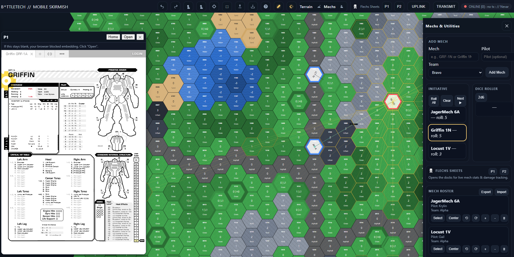

# ⚙️ BATTLETECH // Mobile Skirmish: MSS:84

> **Tabletop tactics — anywhere.**  
> MSS:84 is a browser-based **hex-grid skirmish terminal** for BattleTech.  
> No installs. No login. No dice. Just deploy and play — online or offline.

---

## 🧭 Overview

MSS:84 recreates BattleTech tactical combat on a digital hex map.  
Built for **tablets, laptops, and desktops**, it handles movement, line-of-sight, record sheets, and networked play — while preserving the pen-and-paper feel of BattleTech.

> ⚡ *Fan-built. Professionally engineered. Fully modular.*

---

## 🔗 Cross-App Integration  

Connects directly with **[TRS:80 // Technical Readout System](https://nevar530.github.io/TRS80/)**

- Export Lance JSON from TRS:80  
- Import into MSS:84 to instantly deploy units with names, pilots, and skills  
- Team colors auto-sync (`Alpha`, `Bravo`, `Clan`, `Merc`)  
- Tokens spawn at grid center with record data intact  

🛰 **TRS:80 + MSS:84 = One Connected Digital Force Pipeline**

---

## 🧩 Core Systems

### 🧭 **Hex Grid Engine**
- Adjustable grid, hex size, and zoom scale  
- Paintable **terrain**, **elevation**, and **cover** layers  
- New **structures layer**: buildings, walls, and objectives  
- Preset battlefields (valley, city, ridge, crater)  
- Label overlays for height, terrain, and cover  
- LOS-aware elevation and shadow depth simulation  

### 🏗 **Structures Module** *(New)*
- Catalog-driven from `/modules/catalog.json`  
- Place, rotate, move, and delete objects with grid snapping  
- Real height integration for accurate LOS  
- Auto-saved and restored from local state  
- Fully included in exported JSON presets  
- Adds visual world-building for cities and bases  

### 🤖 **Mech Token Engine**
- Add mechs manually or import from TRS:80 JSON  
- Auto-loads pilot info, skills, and team colors  
- Rotate (Q/E keys or icons), move, and scale tokens  
- Built-in initiative tracker with cycling and highlights  

### 🔭 **Tactical Tools**
- Toggle **Line-of-Sight rays**, **Fire Arcs**, and **Range overlays**  
- Right-click rangefinder between tokens  
- Canvas-based rendering for high-speed updates  
- Optimized for both desktop hotkeys and touch controls  

### 🛰 **Firebase Uplink (Enhanced)**
- Remote play via shared room code  
- “Transmit” sends complete battle snapshot  
- “Receive” instantly applies synced state with sender label  
- Secure Firestore backend, no login needed  
- Optional voice or Discord chat recommended  

### 💾 **Offline Persistence**
- Local autosave triggers only on placement or move state changes  
- Reloads exactly as left — mechs, map, and structures  
- Full JSON export/import support  
- Board capture as PNG image  
- Service Worker caching ensures full offline use  

### 📄 **Integrated Mech Sheets**
- Dynamic in-app record sheets per mech  
- Tracks armor, internals, heat, crits, and ammo  
- Pilot skill and effects fully editable  
- Persists locally and syncs through network play  

### 🎯 **GATOR Console**
*(Gunnery / Attacker / Target / Obstacles / Result)*
- 2d6 digital hit calculator with auto modifiers  
- Handles hit locations, crit checks, and missile cluster rolls  
- Works offline, transparent results  
- Clean inline panel integration with battle HUD  

### 📊 **Flechs Sheets Dock (Optional)**
- Embed [Flechs Sheets](https://sheets.flechs.net) in left/right panels  
- Player-1 / Player-2 dock mode for analog feel  
- Optional alternative to integrated sheet  

---

## 🕹 How to Play

### 1️⃣ **Launch**
→ [https://nevar530.github.io/Battletech-Mobile-Skirmish/](https://nevar530.github.io/Battletech-Mobile-Skirmish/)  
Runs on Chrome, Edge, or Firefox (tablet or desktop preferred).

---

### 2️⃣ **Build the Map**
- Open **left panel** → Paint terrain and adjust height  
- Add cover or buildings  
- Load presets or design custom layouts  
- Structures snap to grid and respect height modes  

---

### 3️⃣ **Deploy Units**
- Use **right panel** → Add manually or import TRS:80 JSON  
- Assign pilots, names, and team colors  
- Tokens spawn centered with proper facing  
- Manage initiative, rotate, or delete as needed  

---

### 4️⃣ **Engage Combat**
- Move and rotate units  
- Toggle LOS and measure ranges  
- Open GATOR console for quick hit checks  
- Track damage on Mech Sheets  
- Sync with Firebase or export for later  

---

### 5️⃣ **Play Remote**
- Click **Uplink → Join Room**  
- Enter a shared phrase (e.g. `ember-orbit-fox`)  
- Opponent joins same code  
- Press **Transmit** after each turn  
- Field state syncs instantly  

---

## 🖼 Gallery

| Screenshot | Description |
|-------------|--------------|
|  | **App Home / Boot Sequence** — amber CRT intro screen |
|  | **Battle Map** — mechs, terrain, and LOS active |
|  | **City Map Preset** — multi-layer terrain example |
|  | **Preset Loader** — quick battlefield setup |
|  | **Flechs Dock** — external sheet integration |
|  | **Cross-App** — TRS:80 → MSS:84 import pipeline |

> 📸 *Add new screenshots:*  
> - `images/wiki/structures.png` – Structures panel open (rotation + placement)  
> - `images/wiki/sheet.png` – In-app mech sheet with armor/heat visible  
> - `images/wiki/gator.png` – GATOR console results panel  
> - `images/wiki/sync_banner.png` – Firebase sync banner (Transmit confirmation)

---

## 🧰 Developer Notes

| Stack | Description |
|-------|--------------|
| **Language** | HTML5 / CSS3 / Vanilla JavaScript |
| **Rendering** | Canvas + SVG multi-layer engine |
| **Data** | JSON manifests (mechs, structures, presets) |
| **Storage** | LocalStorage autosave + Firebase Firestore sync |
| **Architecture** | Modular `/modules/` design, self-contained APIs |
| **Offline Support** | PWA-ready with cached assets |
| **Hosting** | Static GitHub Pages deployment |

---

## 🛡 License & Attribution

**MSS:84** is a **fan-made** tool for the BattleTech community.  
All code © 2025 [Nevar530](https://github.com/Nevar530) under the **MIT License**.

- Mech and weapon data derived from [MegaMek](https://megamek.org) (CC-BY-NC-SA).  
- No proprietary Catalyst Game Labs assets used.  
- Flechs Sheets © BisonAIs (embedded iframe).  

> *BattleTech®, BattleMech®, and related marks are property of The Topps Company, Inc.*  
> *Catalyst Game Labs* is the current license holder.  
> This project is unaffiliated with Topps, Catalyst, Microsoft, or MegaMek.

---

## 🙏 Credits

- **Lead Dev & Design:** [Nevar530](https://github.com/nevar530)  
- **Systems Integration:** ChatGPT (OpenAI), under direct instruction  
- **External Dock:** [BisonAIs – Flechs Sheets](https://sheets.flechs.net)  
- **Testing & Feedback:** Community playtesters & fellow MechCommanders  

> *Inspired by paper maps, coffee-stained record sheets, and thirty years of scorched hexes.*

---

## 📚 Documentation & Wiki

📖 [**MSS:84 Wiki →**](https://github.com/Nevar530/Battletech-Mobile-Skirmish/wiki)  
Includes advanced guides, hotkeys, JSON schema, and module documentation.